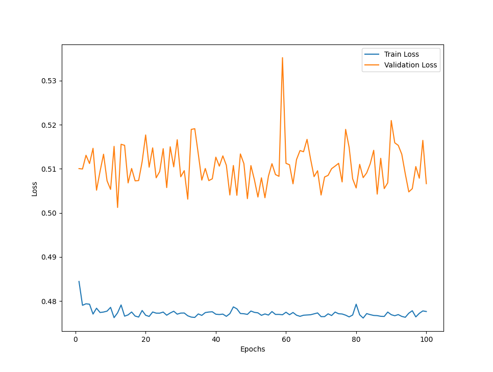

# **Singapore-Airlines-Sentiment-Analysis**

This project use [Kaggle](https://www.kaggle.com/datasets/kanchana1990/singapore-airlines-reviews) datasets to build a model for predicting sentiment analysis of Singapore Airlines  
Reviews are classified into 2 classes: `0` (ratings 1, 2, or 3) and `1` (ratings 4 or 5) based on the reviews they've written

# Pre-Procesing
- Drop unecessary columns
- Remove emojis
- Remove stop words
- Performing lemmatization to reduce words to their base form
- Utilize pre-trained GloVe Embeddings

# Model Architecture
- `Train, Validation, Test Split` = 60%, 20%, 20%
- `Optimizer` = ADAM with weight decay of 0.001
- `Loss Function` = Cross-Entropy Loss
- `Model` = A two-layer LSTM with a hidden size of 128 and its connected with a single layer of neural network to map the output into 2 sentiment classes
- `Learning Rate` = 0.002
- `Batch size` = 64

# Results
Epoch 12: Train_loss=0.4773, Train_Error=0.1850, Train_Acc=81.5000% || Val_Loss = 0.5012, Val_Error=0.2085, Val_Acc=79.1500%

